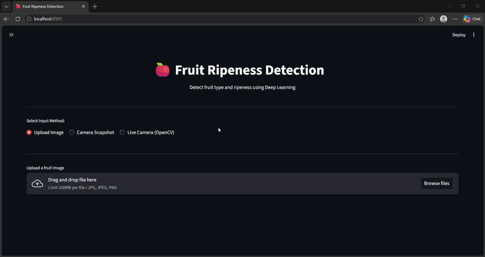

\# 🍎 Fruit Ripeness Detection using Deep Learning


Classifies fruit images as \*\*Unripe / Ripe\*\* using CNN and

MobileNetV2 transfer learning, deployed as a real-time web app via Streamlit.


\## 📸 Demo




\## ⚡ Features

\- Real-time image upload and prediction via Streamlit web UI

\- Two models: custom CNN and MobileNetV2 (transfer learning)

\- Live camera prediction support (`camera\_predict.py`)

\- OpenCV preprocessing pipeline for noise reduction and normalization

\- Model evaluation with accuracy and loss plots


\## 📊 Model Results

| Model | Accuracy |

|---|---|

| Custom CNN | ~69% |

| MobileNetV2 | ~89% |


\## 🛠️ Tech Stack

Python · TensorFlow . Keras · MobileNetV2 · OpenCV · Streamlit · NumPy · Matplotlib


\## 🚀 Run Locally

```bash

git clone https://github.com/Santhosht-5115/fruit-ripeness-detector.git

cd fruit-ripeness-detector

pip install -r requirements.txt

python -m streamlit run app.py

```


\## 📥 Model Weights

\- `fruit\_ripeness\_mobilenet.h5` — included in repo (13 MB)  

\- `fruit\_ripeness\_cnn\_model.h5` — \[Download from Google Drive](https://drive.google.com/drive/folders/1-4hvDepKy1-TnUlinWbuICyT44KcovOl?usp=sharing) (260 MB)


\## 📁 Project Structure

```

├── app.py                    # Streamlit web app

├── camera\_predict.py         # Live camera prediction

├── train.py                  # Model training script

├── preprocess.py             # Image preprocessing (OpenCV)

├── predict\_image.py          # Single image inference

├── models/

│   ├── cnn\_model.py          # Custom CNN architecture

│   ├── mobilenet\_model.py    # MobileNetV2 fine-tuning

│   └── evaluate\_mobilenet.py # Model evaluation

└── fruit\_ripeness\_mobilenet.h5

```

